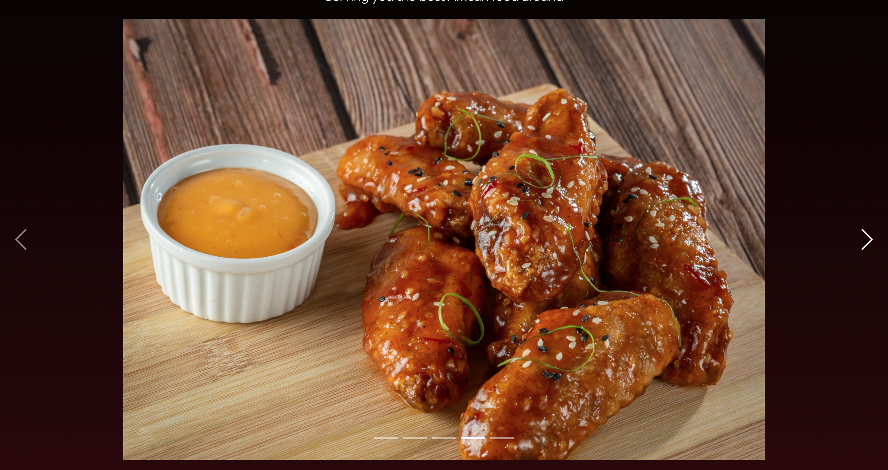
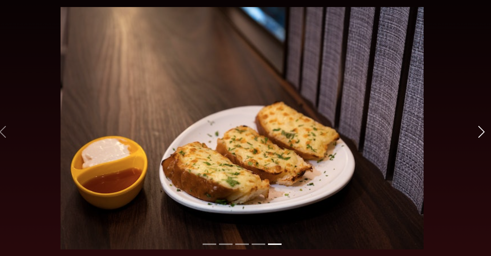

# Rosie's Kitchen

## Introdution

Rosie's kitchen is a retaurant website designed to display the user their menu & enable the user to make/ammend/edit reservations. This project is stricly for educational purposes

---
## UX

## Strategy 
I used an Agile methodology when planning the planning the project, with the use of projects and issues. I used issues to create the user stories for this project which served as a guidelines for building the project.

CRUD functionality is very important when it comes to this webbapp as user interaction is everything. The user is able to create a booking, the webapp will then display all the bookings the user has made, the user will then have the options to either update their bookings or delete any booking they have. 

## User Stories

1. As a user, I am able to navigate through the site and view desired content
2. As a user I can get key information about the restaurant from the landing page
3. As an admin user I am able to login so I can access the site's backend
4. As the site owner, I can display restaurant menu so that the customer knows whats on offer
5. As a user, I want to be able to fill a booking form in order make reservation
6. As user, I want to be able to register in order to log in
7. As a user, I want to be able to make changes to my booking when necessary
8. As a user, I would like to know the opening time in order to make a reservation accordingly
9. As a user, I would like to be able to see all my reservation
10. As a user, I would like to delete the booking if It's no longer convenient

# Structure

## Wireframes

### Homepage

### Menu 

### Register

### Login

### Reservation

## Database

## Features 

**Color Scheme**

**Homepage**
The Navigation bar has all the links to the active pages for the user which are also clearly labelled. The User can 
have a look at the menu via the navigation bar, or if the user chooses, can access the menu via the link under the 
carousel. The same can be done with the "Book" next to the menu, the book link will direct you to the Register page.

If the user is logged in, the dropdown will appear under 'My account" where "My reservation" and "logout" option 
will appear. Another option the user will have is the option to manage their reservations.

**Carousel**

The images that are part of the carousel are the images of the food that is on offer on the website

**Menu**

I have chosen a very minimalistic layout for the menu page. 

**Register**

**Login**

**Make a reservation** 

**Edit reservation**

**Delete reservation**

**Footer**

The footer has all the information regarding the restaurant's opening times, the address and contact information. It 
also the links to their social media account.

### Future Features

- Price displayed under each menu item 
- Allergies information under each menu item 
- Customer newsletter keeping them aware of potential new dishes added to menu
- Add a drinks menu
- have a seperate lunch and dinner menu options 

## Technologies Used

I have used several technologies in order for this project to work 

- [Bootstrap](https://getbootstrap.com/)
    - Bootstrap was used for creating responsive design 
- [Font Awesome](https://fontawesome.com/)
    - font Awesome used for the social media icons on the footer
- [Github](https://github.com/)
    - Used to securely store code after being pushed
- [Gitpod](https://www.gitpod.io/)
    - Used as the developemnt environment
- [Heroku](https://heroku.com/)
    - Used to deploy my project 
- [Django](https://www.djangoproject.com/)
    - The Framework that was used to build the overall project and its app 
- [Cloudinary](https://cloudinary.com/)
    - Cloudinary was used to store images used on the project 
- [Coloors](https://coolors.com/)
    - Coloors was used to generate colour palette for the website
- [Django Allauth](https://django-allauth.readthedocs.io/en/latest/configuration.html)

# Testing 
- For all testing documents please refer to [Testing](TESTING.md)

## Deployment 

### Heroku 

The site was deployed using [Heroku] (https://heroku.com/)

The steps for the deployment are as followed: 

- Login or Sign up to Heroku. 
- Once logged/signed in, from the dashboard click 'New' then click "Create New App"
- Enter a unique name for your project. Once you have chosen the name, select a region
then press "Create New App"
- Set up your Environment variables - a very important step to make sure your application
is deployed properly
- Navigate to "Reveal config vars" and set the following variables
    - SECRET_KEY - to be set to your chosen key 
    - CLOUDINARY_URL - To be set to your Cloudinary API environment 
- Heroku Postgres must be installed

In the deploy Tab
- Click on the deploy tab and then choose "Github-Connect to Github"
- Enter the GitHub repository then click Search
- Choose the correct repository for your application. Once done, click on "Connect"
- You will then be presented with the option of either an automatic deployment or a
manual deployment. The automatic deployment will generate a new application everytime
a change has been pushed to Github, whereas the manual deployment requires the user to 
"Deploy Branch" button whenever the user wants to make a change.
- Once the method of deployment has been selected and click on "Deploy Branch", your 
application should then be built. To see it you will need to click "view"

## Credits 

Throughout the whole process of building this website, I have used a number of sources that has
helped me to fix issues/bugs that have a come across. In addition to that, I have taken some 
inspiration on building the website's functionality from some of the source below

- For the menu app, I drew inspiration from the below documents
    - (https://getbootstrap.com/docs/4.3/components/card/)
- the carousel on the home page 
    - (https://getbootstrap.com/docs/5.0/components/carousel/)
- The Navbar 
    - (https://getbootstrap.com/docs/4.3/components/navbar/)
- Stackoverflow was used at various times to help with my model, views and form
    - (https://stackoverflow.com/questions/849142/how-to-limit-the-maximum-value-of-a-numeric-field-in-a-django-model)
    - (https://stackoverflow.com/questions/61076688/django-form-dateinput-with-widget-in-update-loosing-the-initial-value)
    - (https://stackoverflow.com/questions/50002600/django-models-datefield-prevent-past)
- The Reservation model was based on the link below
    - (https://blog.devgenius.io/django-tutorial-on-how-to-create-a-booking-system-for-a-health-clinic-9b1920fc2b78)
- Unsplash for the pictures used on the app
    - (https://unsplash.com/)
- Pexels for the picture used on the carousel 
    - (https://www.pexels.com/)
- For the class based views, this youtube link was a big help
    - (https://www.youtube.com/watch?v=GxA2I-n8NR8&list=PLOLrQ9Pn6caxNb9eFZJ6LfY29nZkKmmXT&index=1)
- [Django Allauth](https://django-allauth.readthedocs.io/en/latest/configuration.html)

## Acknolegdment 

- Special thanks to my mentor for the advice and the slack community 
