# Testing 

to return to the readme file please click here [README](README.md)

### User Stories 

####  As a User, I would like to be able to navigate the website
- As a user, I am able to navigate through the site and view desired content without issues

#### As as user, I would like to have access to an informative landing page 
- As a user, I would like to be able to be well informed about what the restaurant is all about.

#### Opening time 
- As a user, I would like to know the opening time in order to make a reservation accordingly 

#### Menu
- As a User, I would like to have a view of the menu 

#### Register 
- As a user, I want to register and account in order to make a reservation 

#### Make a reservation 
- As as user, once I have been able to register and account, I would like to be able to start making 
reservations 

#### As a user, I would like to manage my bookings
- As a user, I would like to have access to all my bookings and have the option to either amend or cancel 
any bookings I may have 

#### As a user, I want to be able to amend my reservation
- As a user, I want to be able to amend a reservation for my convenience

#### As a user, I want to be able to delete my reservation
- As a user, I want to be able to delete a reservation if the time and date is not longer
suitable for the user

## Admin login
- As an admin, I want to be able to log in the admin panel and delete accounts of my choice

# Browser Responsiveness

## Iphone SE
 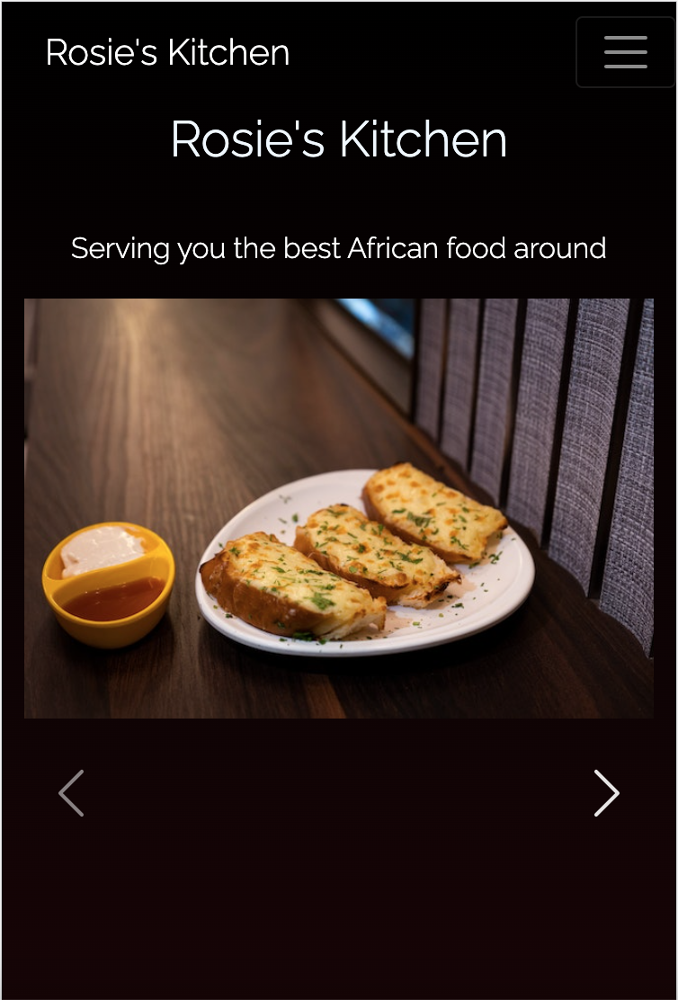
 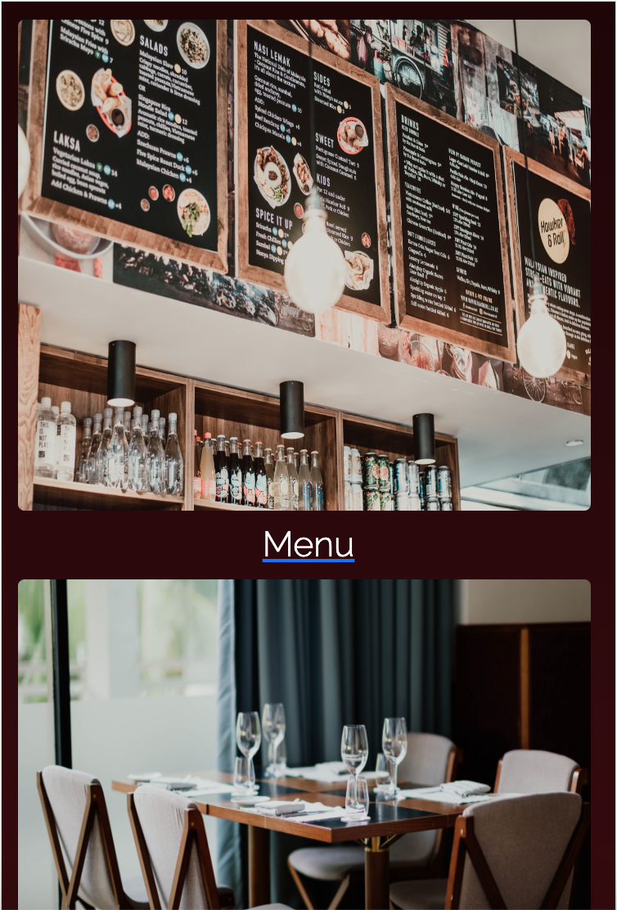
 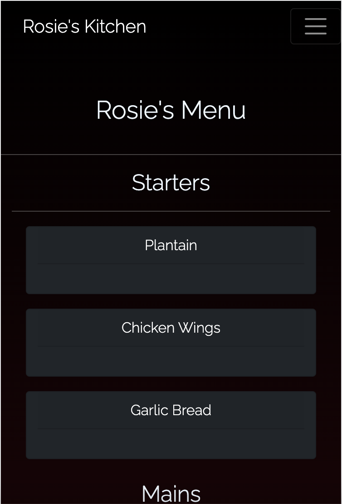

## Iphone 12 
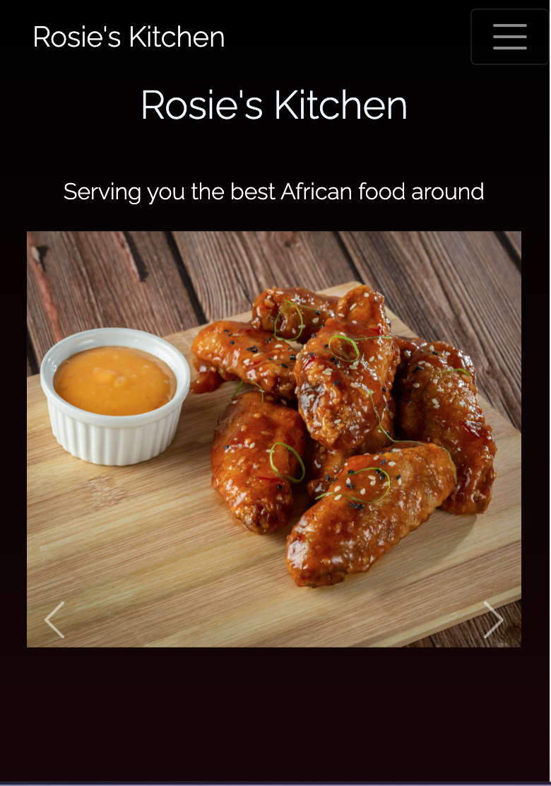
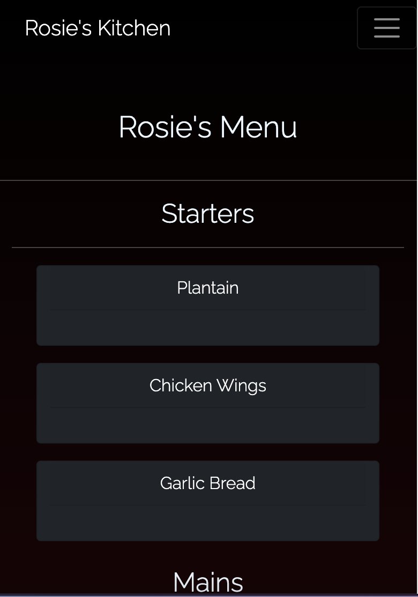

## Samsung Galaxy s8
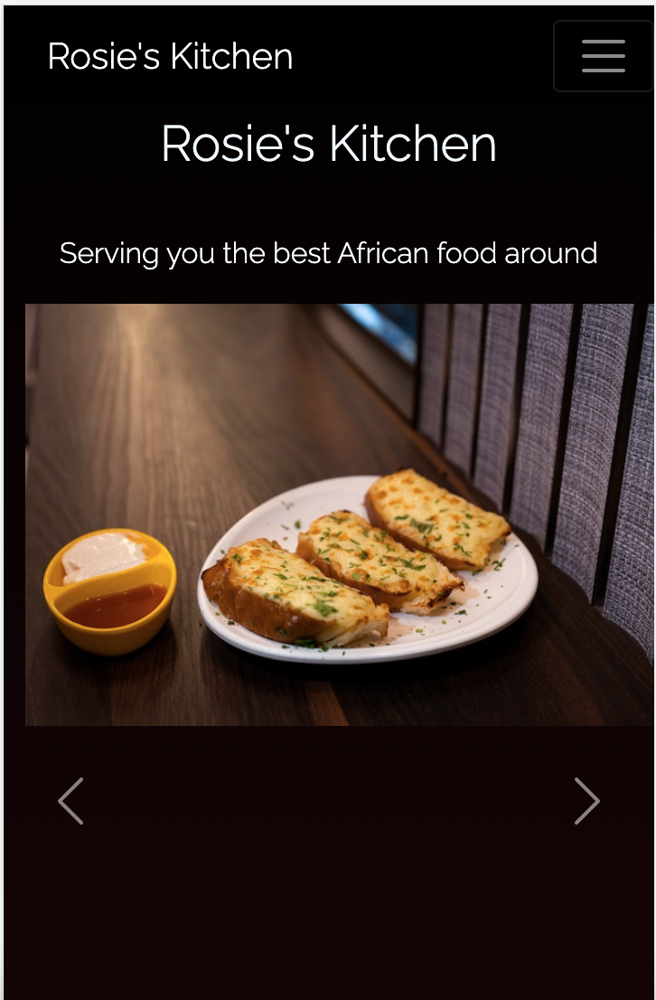
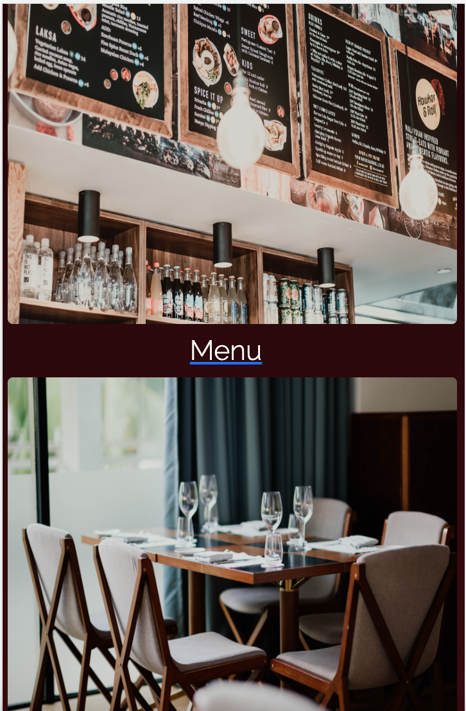

## Ipad 
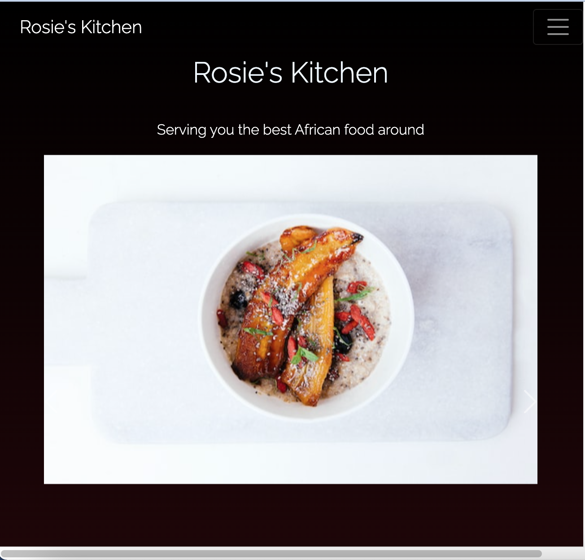
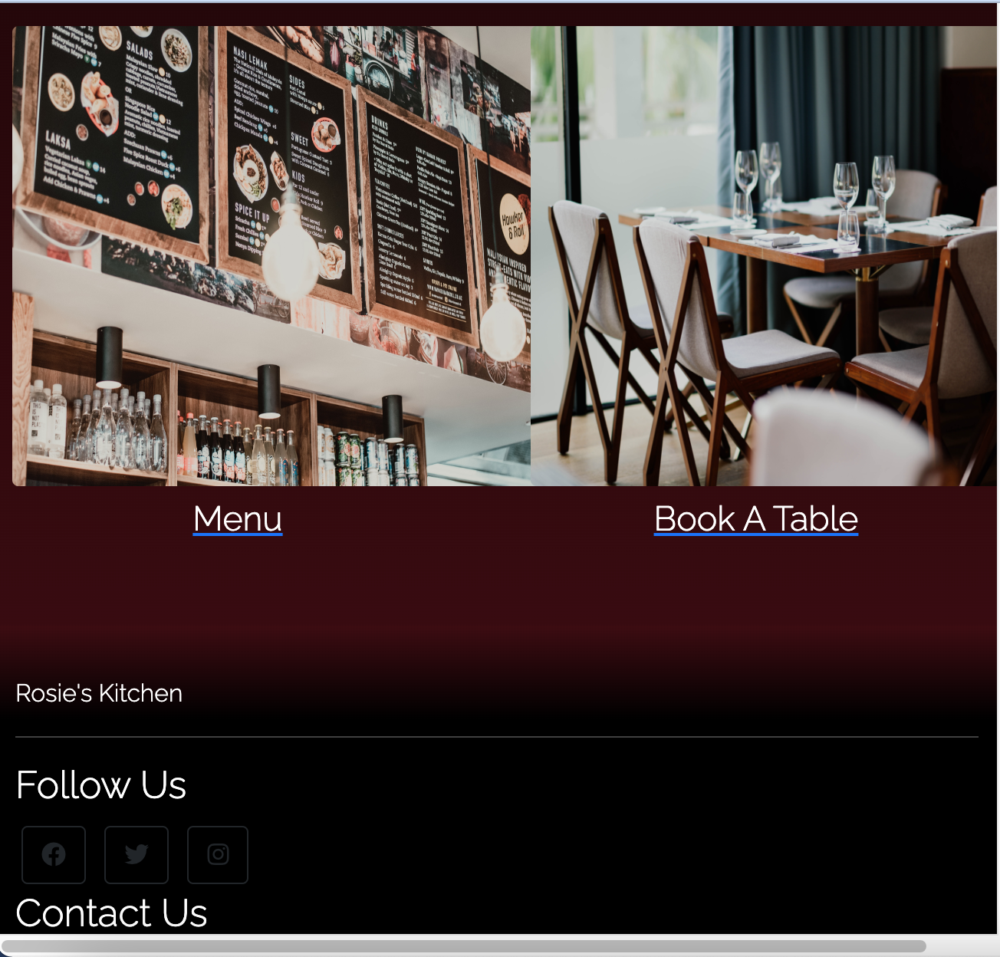

## Firefox 
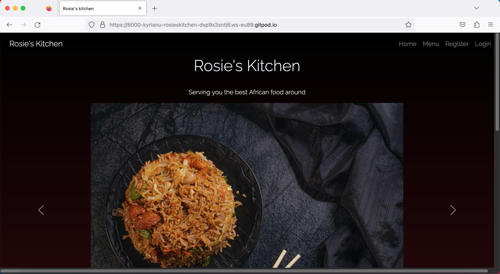

## Safari 
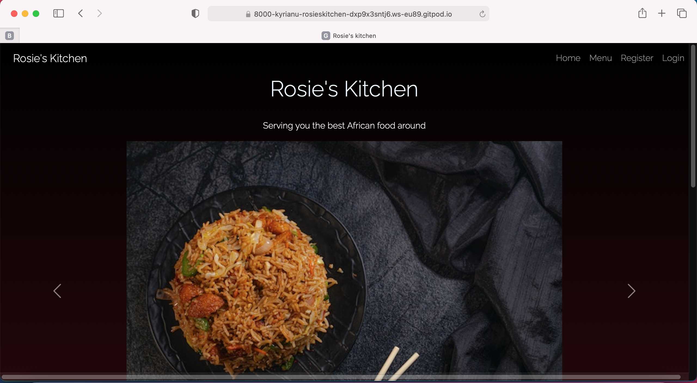

## Chrome

# Code Validation

## Css
-I used [Jigsaw] as tool to validate/check my css code has no issues/errors. The report came back
with no errors

## HTML
- While testing my html files I came across a few errors to which needed rectifying. I managed
to rectify all the minor errors to the best of my knowlegde
!

# Bugs 

## Fixed Bugs
- Users were unable to edit or delete their reservation, this was due to a typing error in the reservation view.
- Users were able to view and make amendments for other users reservations
- Fixed the bug that was enabling user to book a date that's in the past 
- Fixed issue regarding the Date picker, typing error in the forms.py file in the reservation app

## Unfixed Bugs
- Seats option allows you to pick an infinite number, but only allows you to pick 1-4 seats
- Users are able to set duplicate reservation for the same time and day 
